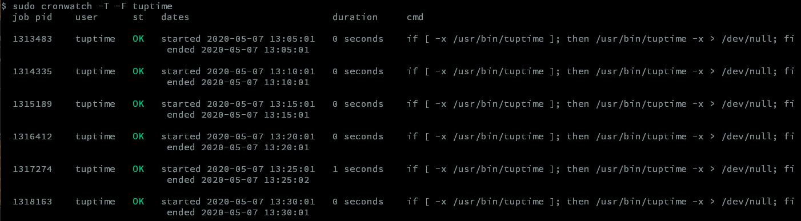

# what is cronwatch ?

cronwatch.sh parse a syslog file and shows you cron jobs status, pid, and duration

# install

## configure cron daemon

### debian

edit `/etc/default/cron` and set loglevel to 15 (add job endtime, status...) :

```
grep 15 /etc/default/cron
EXTRA_OPTS="-L 15"
```

copy the script `cronwatch.sh` in `/usr/local/bin` (or where you want) : `sudo cp cronwatch.sh  /usr/local/bin/cronwatch`

# usage

```
Usage : cronwatch -f [logfile] -F [filter_term] -s [status]
Options :
    -f, --file                      logfile to parse (can be several)
    -0, --ok                        (not implemented yet) filter failed cronjobs
    -1, --ko                        (not implemented yet) filter successfull cronjobs
    -F, --filter                    filter (grep) specific cronjobs
    -t, --timestamp                 display dates and duration in timestamp and second format
    -T, --no-truncate             don't truncate command line

    -d, --debug                     display debug infos
    -h, --help                      display help message

Example :

    cronwatch -f /var/log/syslog* -u root --ko
```

output sample :



# todo

- fix/improve display
- generate html output
- store in database, or create prometheus adapter (and tag system, in comments at the end on cronjob line) ?
- handle input cron logs ? (real time storage)
- change language (python ?)
- unit tests
- period filter

# send mail with aha and mutt

```
cronwatch -T -f /var/log/syslog.4.gz -F root | aha | mutt -e "set content_type=text/html" -s cronwatch -- sylvester@acme.com
```
